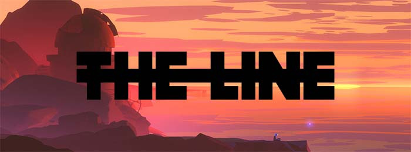
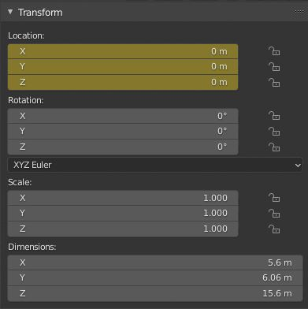
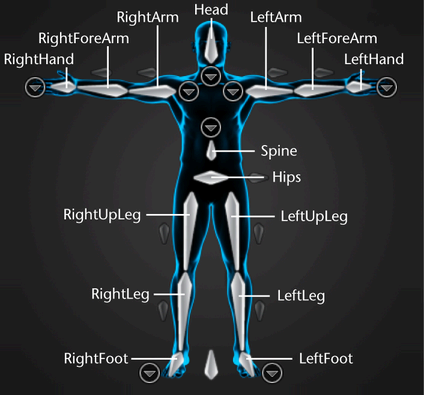
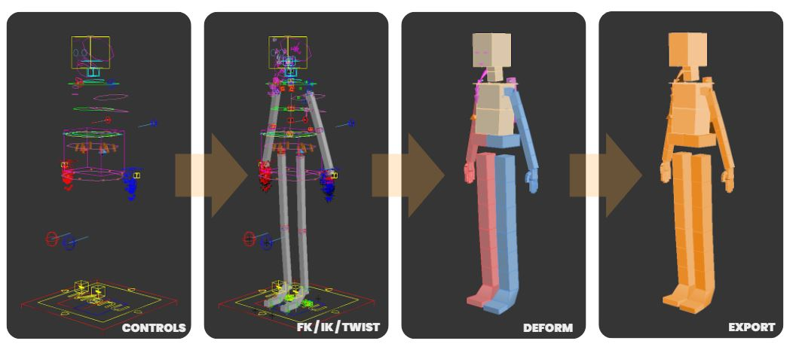
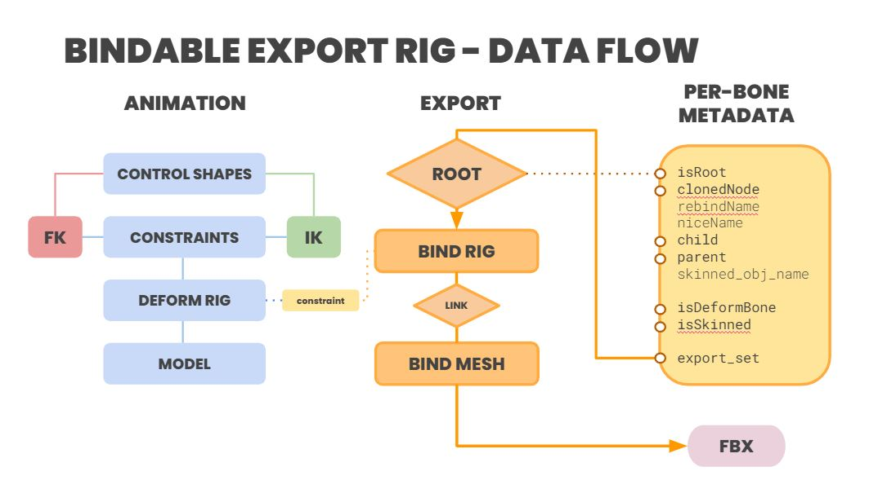
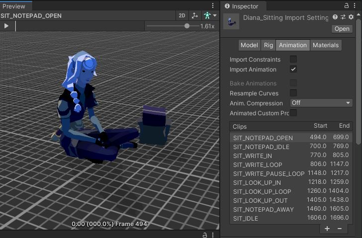

.. ThePipeLine documentation master file, created by
   sphinx-quickstart on Wed Aug 25 14:16:08 2021.
   You can adapt this file completely to your liking, but it should at least
   contain the root `toctree` directive.

3D Realtime Documentation 
===============================
--------------

About these Guides
==================

Working in a real-time engine can initially appear that you are working
inside a harmonious 3D ecosystem, but the reality is that 3d and real
time engines are doing similar things, but speaking different languages.

The following guides are designed to explain the workflows and potential
pitfalls to avoid in creating a smooth and trouble-free workflow between
the world of 3D and real time applications. They are largely general
guidelines, but where required there will be a breakdown for software
specific workflows.

.. tip:: 💡 Working with a games engine shares a lot of history with an *old school* games creation workflow. Many of the techniques for modelling, rigging and export are tried and tested workflows from a time where you had to optimize everything just to make it run. Employing some of these techniques are just as valid today as they were the first time.

Real Time Deployment Platforms
##############################

There are different types of real time applications. Here are the most
common -

-  **Build App** - The traditional route is to build an application or
   executable that runs on a piece of hardware like a desktop computer
   or laptop. Different OS platforms need different versions or ‘builds’
   of software.
-  **Browser Based** - Runs on a variety of devices that have graphics
   capabilities - most computers and mobile devices can run this. This
   will run on a variety of operating systems
-  **App Based** - Dedicated IOS or Android app. Each mobile platform
   will need separate builds.

Key Software Used
#################

-  *For Build Apps* - Unreal Engine, Unity, Godot are the main engines
   in use today, but there are many others able to operate in this
   arena.
-  *For Browser Based* - Three.js, Babylon.js (essentially these are
   javascript libraries that wrap 3d engine capabilities)
-  *For App Based* - Apps can be developed in the key applications above
   although social media platforms have their own DCCs for this, like
   Lens Studio for Snap, and SparkAR Studio for FB/Instagram

Asset Creation Pipeline
=======================

3d Models need to have the following general logic applied -

-  The base file needs the Unit Scale set to **Centimeters**
-  History cleared and/or XForms reset
-  They need their node origin set to **[0,0,0]**
-  All transforms need to be reset or collapsed (PRS)
-  Vertex normals should be correct (unified and all aligned correctly)

Understanding The Transform Matrix
##################################

Games engines can be very unforgiving in regards to meshes containing
transforms that are not based around the *identity matrix*.

.. code:: python

   (matrix3 [1,0,0] [0,1,0] [0,0,1] [0,0,0])

With the exception of character rigs (which may have alternate
transforms) it is good practice to make sure any static meshes are
completely reset and do not have any position, rotation or scale values
other than what is considered *zeroed out*.

.. tip:: 💡 There may be occasions where you can **get away with this** (like rotating an asset post import), but the best practice to ensure that you will get predictable results are to make sure that the geometry is reset prior to export.

Software packages will do this differently so there is a short guide on how to do it in each one below.

Software Specific Workflows
###########################

.. only:: builder_html and (not singlehtml)

   .. container:: tocdescr

      .. container:: descr

         .. figure:: /images/ui/mayaUI.png
            :target: sections/maya/index.html

         :doc:`sections/maya/index`
            Creating game assets in Maya

      .. container:: descr

         .. figure:: /images/ui/blenderUI.png
            :target: sections/blender/index.html

         :doc:`sections/blender/index`
            Creating game assets in Blender

      .. container:: descr

         .. figure:: /images/ui/3dsmaxui.png
            :target: sections/max/index.html

         :doc:`sections/max/index`
            Creating game assets in 3dsMax

Animation Pipeline
==================

FBX is used not only for static meshes, but for skinned meshes as well,
and represents an optimised workflow for characters and animation clips.
Animation will normally be exported to FBX, unless the engine
requirements dictate another format, such as Alembic.

.. important:: 💡 Animation in character rigs will need to have the animation baked per frame in the FBX settings.

This is because there are many systems that are driven or constrained to
each other that the engine will not be able to see post-export.

There are a few ways to achieve this between various software packages.

.. figure:: images/main/FKIK.gif
   :alt: FKIK.gif

.. caution:: 🚨 It is highly likely that a complex character rig will not have the correct hierarchy for many conditions within the engine. Unity and Unreal can use physics and a number of kinematic systems to the export asset, so you will need to plan this aspect into your rig or export process according to the requirements of the project.

Rig Configuration
#################

Game engines like Unreal and Unity require a specific rig configuration.
That’s not to say you can’t have more bones than this (like twists or
props etc) but the underlying deform rig should conform to this layout
if you want a consistent and predictable pipeline between the packages.

Let’s examine the 3 main categories for categories for rigs -

-  **Forward Kinematics**
-  **Inverse Kinematics**
-  **Deform or Bind Rigs**

.. caution:: 🚨 A games engine doesn’t know *anything* about FK or IK in another 3D package. It is only looking at the deform rig and the animation that is baked into it.

This is fine if you are using the export and playing back animation
clips, but most of the time you will want to add extra systems specific
to the engine in order to enhance the experience.

Things like props can also present a challenge as they need to pass
their hierarchy between then rig and the world - for example a character
that removes a bag and places it on the floor.

Export Considerations
#####################

There could be a number of different packages all feeding into the
export process, despite there being a common interop format.

.. figure:: images/main/Process.png

So at the export stage, you need a way of separating the deform bones
and the geometry so that it can conform to the game engine’s
specification.

One way to approach this is to build a fourth skeleton - What we would
call an **export** rig that is **bound** to the deform rig.

The structure of this is a baked, constrained, Forward kinematic rig of
the deform bone chains. Since this is constrained, the parent hierarchy
can be setup exactly as the engine requires, and there is no extra
complexity from baking hidden nulls to preserve the usability of the rig
skeleton.

There are a number of ways to accomplish this, but one approach is to
build a dependency system via attributes off the animation rig. Holding
metadata per bone on the export rig would allow you to re-connect the
export rig to another animation file if needed, and create export sets
of asset collections.

Bones Per Vertex
################

Games engines can also have issues with the number of bones that are
influencing a particular vertex. Traditionally this was set to 4. If
this is an issue, you need to configure the skinning parameters prior to
export.

-  **Blender (2.93+)**

   Make sure you are set to weight paint mode. Go to **Weights > Limit
   Total**

   .. figure:: images/main/Blender_Limit_total.jpg
      :alt: Blender_Limit_total.jpg

   You’ll see the confirmation dialog pop up to validate. This should be
   set to 4

   .. figure:: images/main/Blender_Limit_total_confirm.jpg
      :alt: Blender_Limit_total_confirm.jpg

-  **3dsMax**

   In each skin modifier that is to exported, find the **advanced
   parameters** rollout and change **Bone Affect Limit**

   .. figure:: images/main/skin_3dsmax.jpg
      :alt: skin_3dsmax.jpg

   You can also execute the following Maxscript function on the current
   selection.

   .. code:: python

      fn setupSkinParameters =
          (   
              cSel = if selection.count > 0 then 
                  for obj in selection collect obj
                      else objects

              max modify mode     

              for i in cSel where isProperty i #skin do
              (
                  ::sk = i.modifiers[#Skin]
                  modPanel.setCurrentObject sk
                  subobjectLevel = 1
                  sk.filter_vertices = on

                  if (skinOps.GetNumberVertices sk) > 0 then
                  (
                  skinOps.SelectVertices sk #{1..(skinOps.GetNumberVertices sk)}
                  skinOps.bakeSelectedVerts sk
                  sk.showNoEnvelopes = true
                  sk.bone_Limit = 4       
                  skinOps.SelectVertices sk #{}
                  subobjectLevel = 0
                  )
              )
          )

-  **Maya**

   This can be set a number of ways - firstly when initializing the skin
   bind -

   .. figure:: images/main/maya_bind_skin.jpg
      :alt: maya_bind_skin.jpg

   If you want to do this to an existing model, navigate to the skin
   cluster in the attribute editor and change **max influences** here -

   .. figure:: images/main/maya_inlfuneces_attr.jpg
      :alt: maya_inlfuneces_attr.jpg

   Or use the option in the skin menu - You’ll get a familiar dialog pop
   up and you can enter 4 and confirm it.

   .. figure:: images/main/maya_set_influences.jpg
      :alt: maya_set_influences.jpg

Animation Takes
###############

FBX contains a data section called an Accumulator, and this is where
information about the animation clips can be configured.

Why do this? It allows there to be a clear description for the real time
developer to see what the names and durations of each clip are.

Another bonus is as the takes are referred to by name, it allows a
seamless way to update the animation at any point.

.. important:: 🚨 This needs to be done before exporting the animation to FBX.

.. _software-specific-workflows-1:

Software Specific Workflows
###########################

.. only:: builder_html and (not singlehtml)

   .. container:: tocdescr

      .. container:: descr

         .. figure:: /images/ui/mayaUI.png

            :target: sections/maya/fbx.html

         :doc:`sections/maya/fbx`
            Setting up take exports in Maya and Max

      .. container:: descr

         .. figure:: /images/ui/blenderUI.png
            :target: sections/blender/fbx.html

         :doc:`sections/blender/fbx`
            Using the NLA Editor to export animation from Blender

*