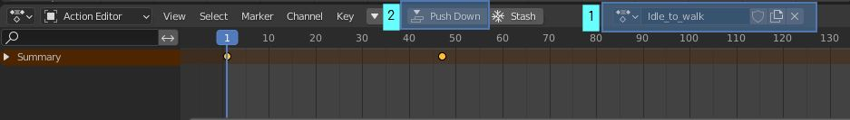
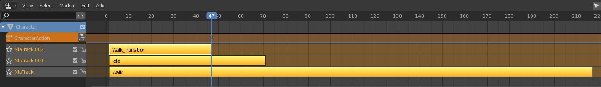
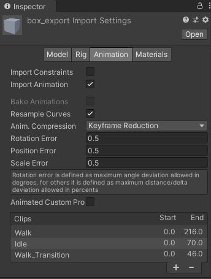

.. ThePipeLine documentation master file, created by
   sphinx-quickstart on Wed Aug 25 14:16:08 2021.
   You can adapt this file completely to your liking, but it should at least
   contain the root `toctree` directive.

|blender_icon| Blender 
======================
.. |blender_icon| image:: /images/ui/blender_logo.png/

The workflow in Blender is slightly different, but you can setup actions
containing the animation clips in the Non Linear Animation editor.

`Nonlinear Animation - Blender
Manual <https://docs.blender.org/manual/en/latest/editors/nla/index.html>`__

You’ll need to split the Timeline into 3 panels, one for the Timeline,
the other to a Dopesheet set to Action Editor mode, and the last to an
NLA Editor.

.. figure:: ../../images/fbx/Blender_NLA_Layout.jpg
   :alt: Blender_NLA_Layout.jpg

In order to export multiple animations in an FBX file, the animations
will have to be stored as NLA action strips. You can do this by pushing
down the animation from the Action Editor.

.. important:: 💡 Make sure you name the action before pressing **Push Down**

You will then see the animation as a strip in the NLA stack. Make sure
the Start Frame and End Frame of each animation are set correctly here,
because these are the values that will be used when exported.

You can layer them like this, or place them in a long linear timeline if
you prefer.

When you export to FBX, make sure you check NLA Strips (And not all
actions) and make sure Simplify is set to 0.0, as you don’t want it to
remove any keyframes.

.. figure:: ../../images/fbx/Blender_NLE.jpg
   :alt: Blender_NLE.jpg

You should be able to see the NLA tracks exported correctly in the FBX
file, named correctly with durations.

.. toctree::
   :maxdepth: 2
   :caption: Contents:

