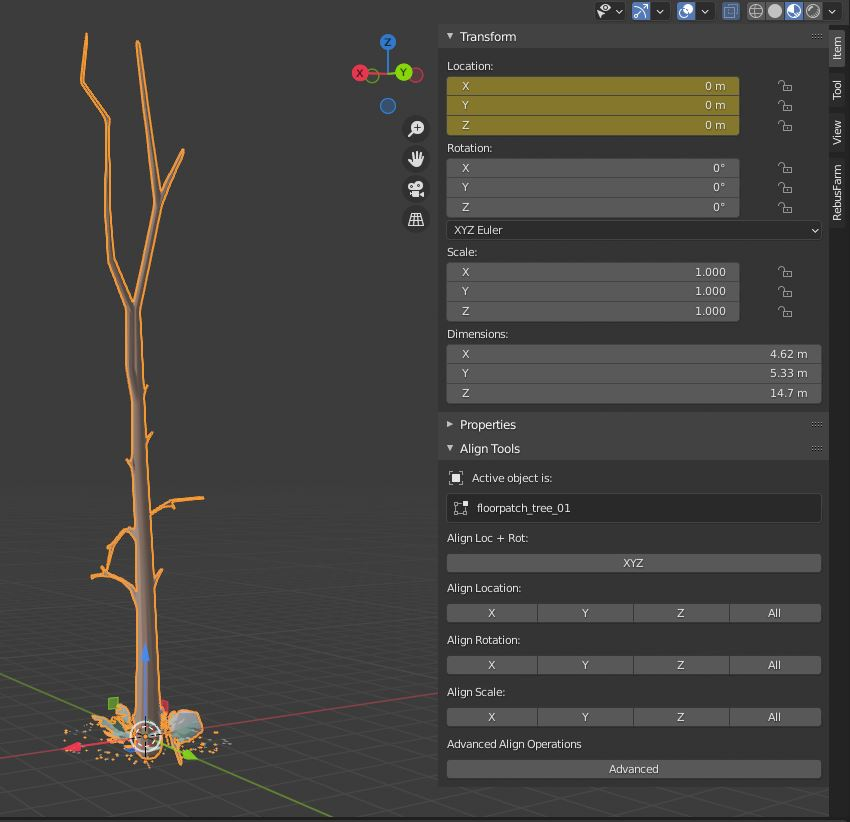
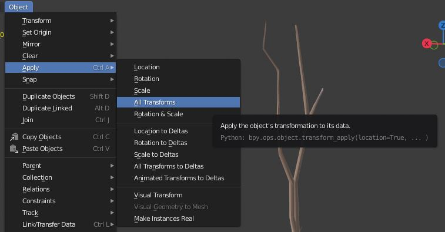
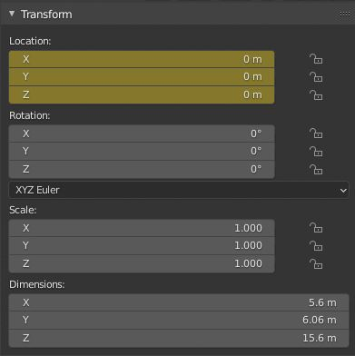
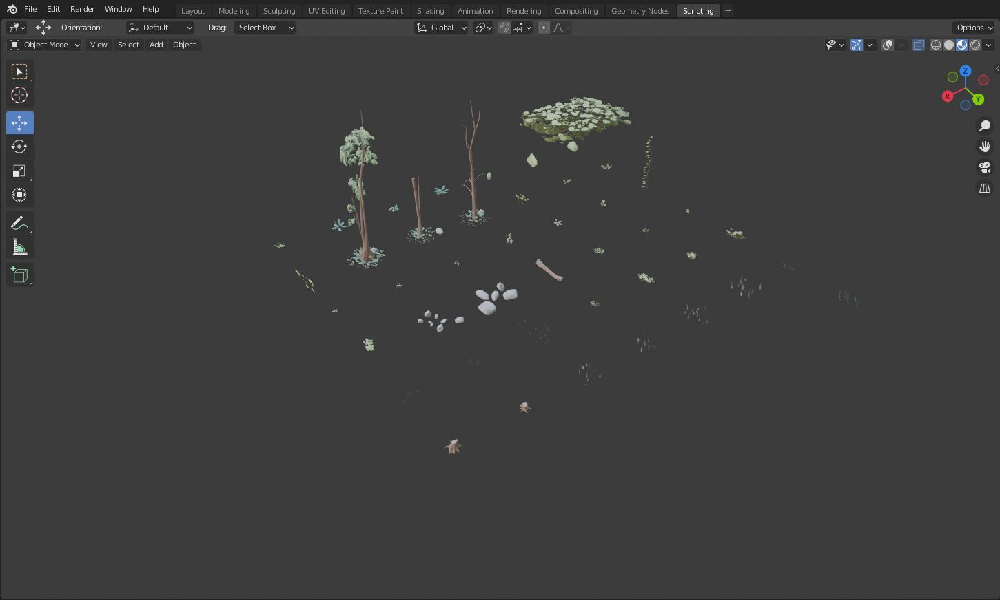

.. ThePipeLine documentation master file, created by
   sphinx-quickstart on Wed Aug 25 14:16:08 2021.
   You can adapt this file completely to your liking, but it should at least
   contain the root `toctree` directive.

|blender_icon| Blender 
======================
.. |blender_icon| image:: /images/ui/blender_logo.png/

Blender is pretty good for being able to collapse geometry on export,
but the procedure for doing this should still be adhered to akin to
other software.

The general principles of model export apply -

-  The base file needs the Unit Scale set to **Centimeters**
-  History cleared and/or XForms reset
-  They need their node origin set to **[0,0,0]**
-  All transforms need to be reset or collapsed (PRS)
-  Vertex normals should be correct (unified and all aligned correctly)

Clear Transforms
################

Your asset should have no values in the Location, rotation columns, and
the scale should be set at [1,1,1]

.. tip:: 💡 The pivot or origin will dictate where the object is in relation to the floor or any distribution system you are using, so make sure this is in a logical place on the model.

Apply Transforms
################

Once the model’s pivot is in the correct position, perhaps the most
important step to ensure the placement and orientation of an object is
consistent in the game engine is to apply the transforms. This bakes the
current state of the object and resets the transform matrix to be
uniform.

.. tip:: 💡 When your object is in the correct position, choose **Object > Apply > All Transforms** or hit **CTRL + A > All Transforms**

If everything has been applied, you should see no values in the
transform and rotation columns, and the scale should be reset.

Grid Layout For Multi Assets
############################

If you are building a file with multiple assets, you can lay them out in
a grid and put an animation key on them. This will allow you to preview
all assets in relation to each other, but still export at the origin
with **animation** disabled in the FBX options.

.. important:: 🚨 Make sure you have setup and applied the transforms of all the objects
in your layout scene first.

.. tip:: 💡 Frame 0 - All Assets at Origin Frame 1 - All Assets snap to grid position

.. figure:: https://raw.githubusercontent.com/abdoubouam/spreadobjects/master/Demo.gif
   :alt: https://raw.githubusercontent.com/abdoubouam/spreadobjects/master/Demo.gif

You can grab the spread objects add-on here -

`GitHub -
abdoubouam/spreadobjects <https://github.com/abdoubouam/spreadobjects>`__

Blender’s Batch Export Options
##############################

Blender’s FBX exporter is pretty fully featured. Here’s an overview of
the settings you can use to export reliably. Click any of the ../../images to
see the setting in greater detail.

1. Go to File > Export and choose FBX…

   .. figure:: ../../images/assets/blender/Blender_FBX_01.jpg
      :alt: Blender_FBX_01.jpg

2. The defaults work pretty well, but we have found checking **Apply
   Transform** to give good results with static meshes.

   .. tip:: 💡 If you are not using a batch mode, make sure you use **Selected Objects** , unless you want the whole scene to be exported.

   .. figure:: ../../images/assets/blender/Blender_FBX_02.jpg
      :alt: Blender_FBX_02.jpg

3. If you are not using a batch mode, make sure you use **Selected
   Objects** , unless you want the whole scene to be exported.

4. If you are exporting multiple assets from one file, consider using
   the Batch modes.

   .. figure:: ../../images/assets/blender/Blender_FBX_03.jpg
      :alt: Blender_FBX_03.jpg

5. A good option here is to organise your assets into separate
   collections and use the **Scene Collections** batch option.

   .. figure:: ../../images/assets/blender/Blender_FBX_03_HL.jpg
      :alt: Blender_FBX_03_HL.jpg

   This way, if you need to add anything to a particular asset, you just
   add to that collection and it will automatically be exported.

   .. figure:: ../../images/assets/blender/Blender_FBX_Layout01.jpg
      :alt: Blender_FBX_Layout01.jpg

6. To use the FBX option of Embed Textures in Blender, you need to set
   the **path mode** to **Copy,** and check the button to the right of
   the drop down.

   .. figure:: ../../images/assets/blender/Blender_FBX_04_batch.jpg
      :alt: Blender_FBX_04_batch.jpg

   .. figure:: ../../images/assets/blender/Blender_FBX_05_batch.jpg
      :alt: Blender_FBX_05_batch.jpg

   .. raw:: html

      <aside>

.. caution::    🚨 Note - Engines like Unity do not recommend embedding textures in the FBX file, as you need to extract textures before using them. Embedding them can bloat your project unnecessarily and slows the import process. Only use this if this is not a concern and you know why you are doing it.

7. If you are exporting transform animation, make sure to check **Bake
   Animation,** otherwise leave this unchecked.

   .. figure:: ../../images/assets/blender/Blender_FBX_08_TM.jpg
      :alt: Blender_FBX_08_TM.jpg

   If you are exporting skinned animation with armatures, you can enable
   **Only Deform Bones**

   .. figure:: ../../images/assets/blender/Blender_FBX_09_TM.jpg
      :alt: Blender_FBX_09_TM.jpg

8. The default axis transforms should work just fine. You obviously want
   the scale to be 1.0. Check **Apply Transform**

   .. figure:: ../../images/assets/blender/Blender_FBX_06_TM_apply.jpg
      :alt: Blender_FBX_06_TM_apply.jpg

   .. caution:: 🚨 Don’t use this option on animations. It will most likely break them! Only use for static meshes.

9. **Apply Modifiers** will bake any parametric modifiers into the mesh
   (which won’t transfer otherwise)

   .. figure:: ../../images/assets/blender/Blender_FBX_07_TM.jpg
      :alt: Blender_FBX_07_TM.jpg

Scripted Export using the Python API
####################################

.. figure:: ../../images/assets/blender/python-logo-master-v3-TM-flattened.png
   :alt: python-logo-master-v3-TM-flattened.png

For the Beats project, we wrote a custom script to export each selected
object to an individual file.

.. tip:: 💡 This kind of behaviour can be done with the scene collections export
workflow above, but it’s still included here for any scenarios where it
can be used.

It automatically sets up the exporter with the correct flags for export.

`Beats_Export_Data.py <https://drive.google.com/file/d/1DcXC1tcpBQ4NIEh1tA_I6QPwVTSEs_bo/view?usp=sharing>`__

To use, download the file above.

1. Open a new panel and change it to a text editor **(Shift + F11**)

   .. figure:: ../../images/assets/blender/scripting_text_edit_blender.jpg
      :alt: scripting_text_edit_blender.jpg

2. Drag the .py file into this panel or click Open and navigate to the
   file.

   .. figure:: ../../images/assets/blender/Export_script.jpg
      :alt: Export_script.jpg

3. You’ll see the file load into the text editor.

   .. figure:: ../../images/assets/blender/Export_script_02.jpg
      :alt: Export_script_02.jpg

4. Click the run script icon (or press **ALT + P**)

   .. figure:: ../../images/assets/blender/Export_script_03.jpg
      :alt: Export_script_03.jpg

5. Go to a 3d Panel. The script is located in the sidebar. Press **N**
   to show it or click the handle in the viewport.

6. Select some objects and press **Export Selected to FBX**.

   .. figure:: ../../images/assets/blender/Export_script_04.jpg
      :alt: Export_script_04.jpg

.. important:: 🚨 Make sure the blender file is saved before you run it - there are no directory options, the script automatically puts all FBXs into a folder relative to the blend file

.. toctree::
   :maxdepth: 2
   :caption: Contents:

