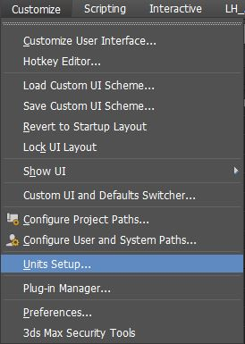
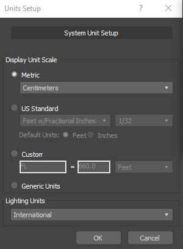
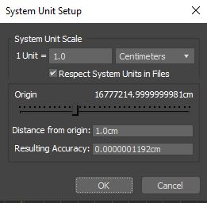
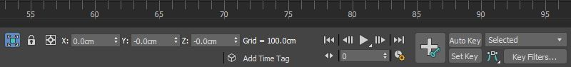
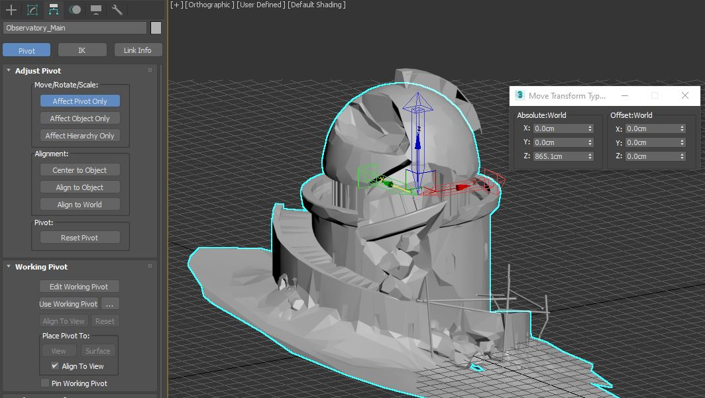
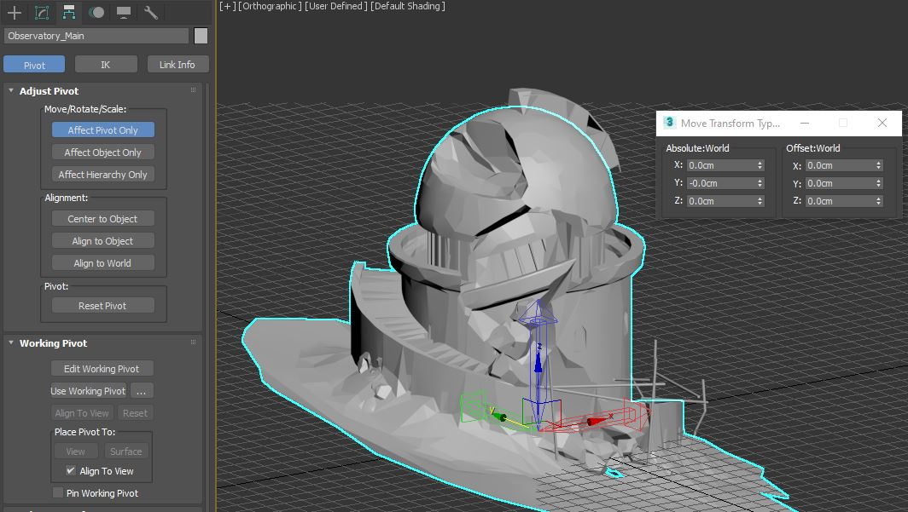
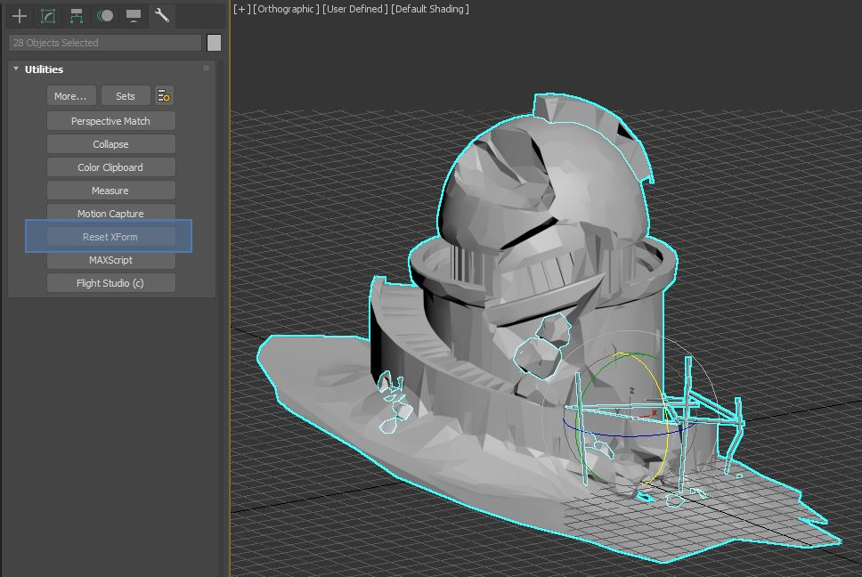
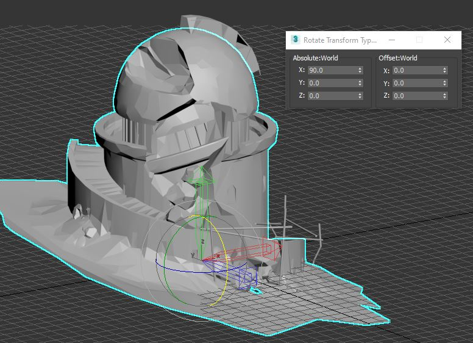
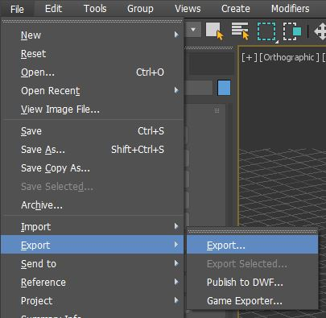

.. ThePipeLine documentation master file, created by
   sphinx-quickstart on Wed Aug 25 14:16:08 2021.
   You can adapt this file completely to your liking, but it should at least
   contain the root `toctree` directive.

|max_icon| 3dsMax 
=================
.. |max_icon| image:: /images/ui/3ds-max-logo.png/

As always, follow the general guidelines on model export in order to
ensure the geometry is ready for export.

-  The base file needs the Unit Scale set to **Centimeters**
-  History cleared and/or XForms reset
-  They need their node origin set to **[0,0,0]**
-  All transforms need to be reset or collapsed (PRS)
-  Vertex normals should be correct (unified and all aligned correctly)

Setting the Unit Scale
######################

In the main menu, go to **Customise > Units Setup**

3dsMax is able to display a different unit scale to the one it uses
internally. This dialog shows the display units, it’s not what you need
to check here. Click **System Units Setup**

Make sure that 1 Unit is equal to 1.0 Centimeters in the System units
Setup

Resetting the Pivot
###################

Check the transform location of the object (You can right click the move
tool icon to check this or check the current tool display in the bottom
toolbar.

Go into the hierarchy tab and click **Pivot**

Clear the pivot transform (The object will not move) You may have to
additionally click **Reset Pivot** in some cases.

Navigate to the utilities tab. Locate **Reset Xform** and press it.

If you are having issues with a particular mesh, you can create an empty
geometry node and attach the mesh to it. The following script will
automate this.

.. note:: 💡 This will perform what is known as a **hard reset** on the mesh and will fix most transform related export issues.

.. code:: python

   fn prepGeoForUnityExport obj r:[90,0,0] resetType:#hard = 
   (
       local objlayer = obj.layer  
       oPos = obj.pos
       objlayer.current = true             
       if obj.material != undefined then sourcemat = copy obj.material         
       showVertCols = obj.showVertexColors 
       showVertColsType = obj.vertexColorType  

       if resetType == #soft then
       (
       ResetXForm obj
       cObj = obj  
       )
       else
       (
           cObj= editable_mesh name:(uniquename "temp")
           convertTo cObj Editable_Poly --convert to Editable_Poly             
           cObj.name = Obj.name        
           cObj.pos = oPos
           cObj.wireColor = Obj.wireColor
           polyOp.attach cObj Obj
           if sourcemat != undefined then cObj.material=sourcemat
           cObj.showVertexColors = showVertCols
           cObj.vertexColorType = showVertColsType 
       )
       
       cObj.showFrozenInGray = off
       cObj
   )

   for i in selection do
       prepGeoForUnityExport i

Aligning the Pivot
##################

.. tip:: 💡 Due to 3dsmax’s coordinate system being Z-up, The Unity game engine requires the pivot to be rotated prior to export. This will mean the import will be clean of rotation transforms and prevent model being the wrong orientation.

If you are a TD or technical artist, you can run the following maxscript to perform this step.

.. code:: python

   /*
       [FUNCTION]: AlignPivotForUnity
           Sets the pivot alignment for correct TM value export to Unity.
       [ARGUMENTS]:
           <NODE> obj : The object to be exported
       [OPTIONAL ARGUMENTS]:
           <BOOLEAN> addMat : Adds a default grey standard material
       [RETURN]: none
       [USAGE]: function - Call AlignPivotForUnity selection[1] or for i in selection do AlignPivotForUnity i
   */  
   fn AlignPivotForUnity obj addMat:true =
   (   
       obj.showFrozenInGray = off

       local rotValInv=inverse ((eulerAngles 90 0 0) as quat)
       animate off in coordsys local obj.rotation*=RotValInv
       obj.objectoffsetpos*=RotValInv
       obj.objectoffsetrot*=RotValInv
       
       if addMat then
       (
           m = standard diffuse:gray name:(obj.name + "_Mat")
           obj.material = m
       )
   )

Exporting the Meshes
####################

If you are not needing to configure animation takes, the standard Export
and Export Selected will work fine if you’ve followed the guidelines
above.

.. toctree::
   :maxdepth: 2
   :caption: Contents:

