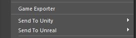
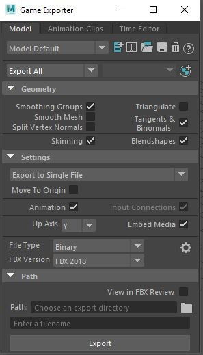
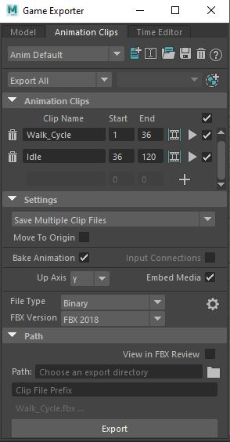
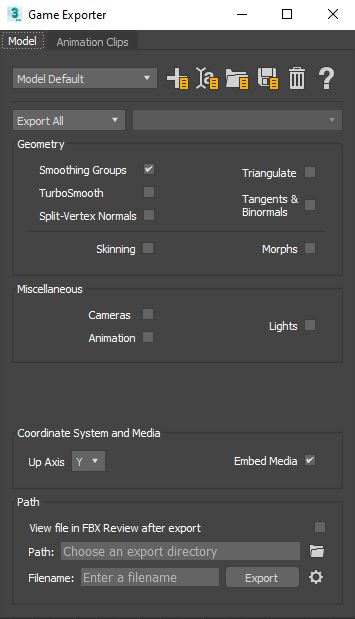
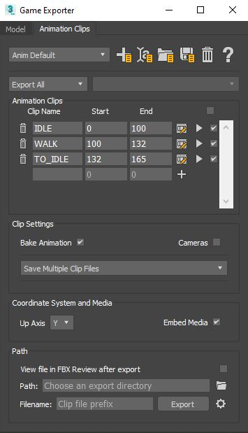

.. ThePipeLine documentation master file, created by
   sphinx-quickstart on Wed Aug 25 14:16:08 2021.
   You can adapt this file completely to your liking, but it should at least
   contain the root `toctree` directive.

Autodesk Maya and 3dsMax
=========================

Being Autodesk products, 3ds Max and Maya have the same workflow for
setting up animation takes for the FBX file. Both software packages use
the aptly-titled *Game Exporter* to achieve this.

In Maya, the Game Exporter is located in the **file** menu

The FBX export options can be configured here

The Animation clips are specified in the next tab along.

Additionally, there are a couple of options in this menu for sending
directly to specific engines. More information is in the Autdesk
documentation.

.. image:: ../../images/ui/unity-logo-small.png
   :target: https://knowledge.autodesk.com/support/maya/learn-explore/caas/CloudHelp/cloudhelp/2022/ENU/Maya-DataExchange/files/GUID-01D019BF-4686-469C-98A1-FDA30C75FFAE-htm.html

Autodesk usually do this is you are working on the same machine to make
to export process a little more direct. But mostly, you will be sending
the export to another artist or developer, so the standard Game Exporter
workflow is usually better.

|max_icon| 3dsMax 
#################

In 3dsMax, the dialog is slightly different but the workflow is the
same.

In 3dsMax, press the X key and search for **Game Exporter**

When setup, hit export to save the takes to FBX.

.. toctree::
   :maxdepth: 2
   :caption: Contents:

